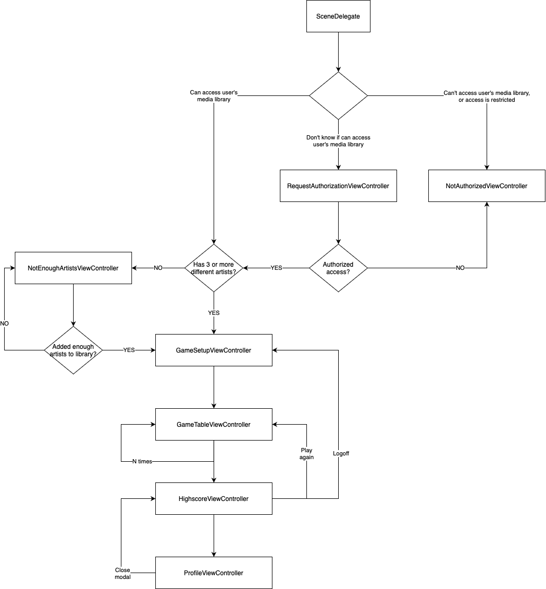

# Who Sings 🎤

This is a simple quiz game where you have to choose the artist that sings a specific line of lyrics. It uses the `MediaPlayer` framework to read your local music library, and also the Apple Music and Musixmatch API.

## How to run this project

Insert your Apple Music token and Musixmatch API key in the `Token` struct. If you don't have one, follow the instructions bellow:

1. Apple Music: [Getting Keys and Creating Tokens](https://developer.apple.com/documentation/applemusicapi/getting_keys_and_creating_tokens)
2. Musixmatch: [Get a API key](https://developer.musixmatch.com/signup) to access the API.

## Diagram

Here's a simple diagram to quickly illustrate all possible paths the app can take:

## Notes

- Developed on Xcode 12.3, for iOS 14.
- Network calls are implemented with `URLSession`.
- Logs implemented with `os.log`.
- Highscore persisted on `UserDefaults`.
- UI implemented in code, using `UIKit`, supporting portrait and landscape, and dynamic fonts.